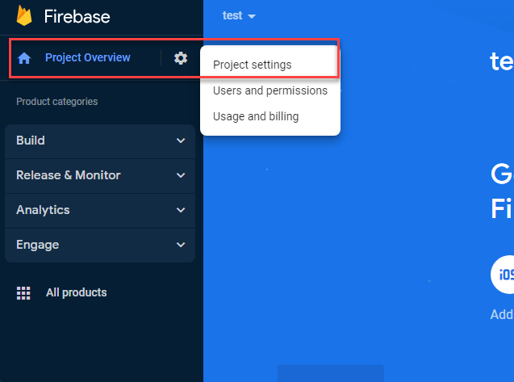

# firebase-api

How to create  a firebase project:

1.- go to https://firebase.google.com/
2.- Click  the button  "Get Started"
3.- Click  the button "Add Project"
4.- Add a project  Name
5.- Disable "Enable Google Analytics for this project" and click "Create project"
6.- Open Project settings  
7.- Create new Real Time Database 
8.- Click  The Button  "Create Database"
9.- Select the desired Location and click "Next"
10.- Select Test Mode  and click Enable
11.- Locate the DB URL and the rules editor  This is the Firebase URL to be used by the API

How to enable Authentication:

1.- Select Authentication  and click "Get Started"
