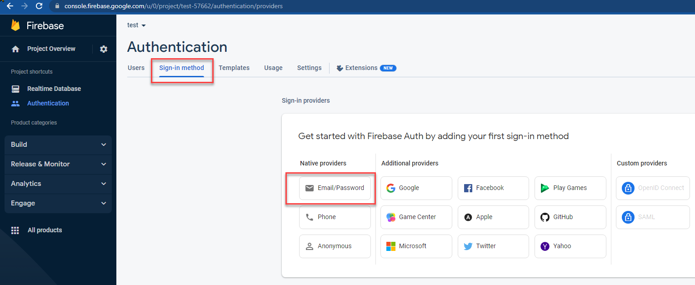

# firebase-api

## How to create  a firebase project:

1. go to https://firebase.google.com/
2. Click  the button  "Get Started"
3. Click  the button "Add Project"
4. Add a project  Name
5. Disable "Enable Google Analytics for this project" and click "Create project"
6. Create new Real Time Database 
7. Click  The Button  "Create Database"
8. Select the desired Location and click "Next"
9. Select Test Mode  and click Enable
10. Locate the DB URL and the rules editor  This is the Firebase URL to be used by the API

## How to enable Authentication:

1. Select Authentication  and click "Get Started"
2. Select Sign-in method tab and click the "Email/Password" Button
3. Click the Enable "Email/Password" Checkbox and click the "Save" Button
4. Go to the Project Overview-> General  and copy that, this 
