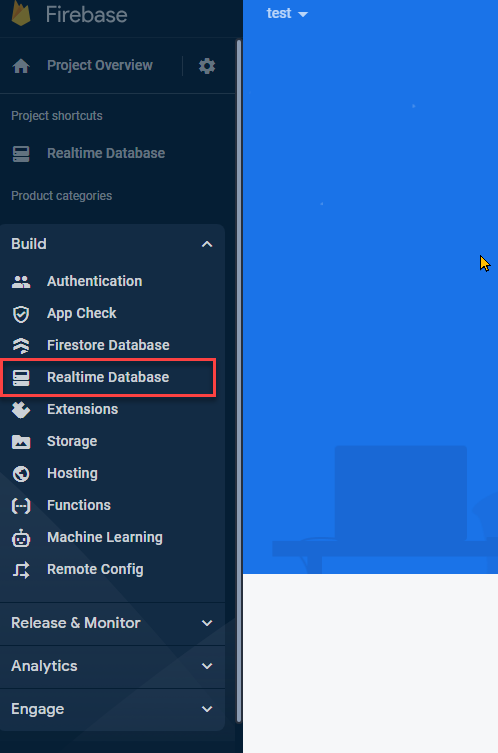
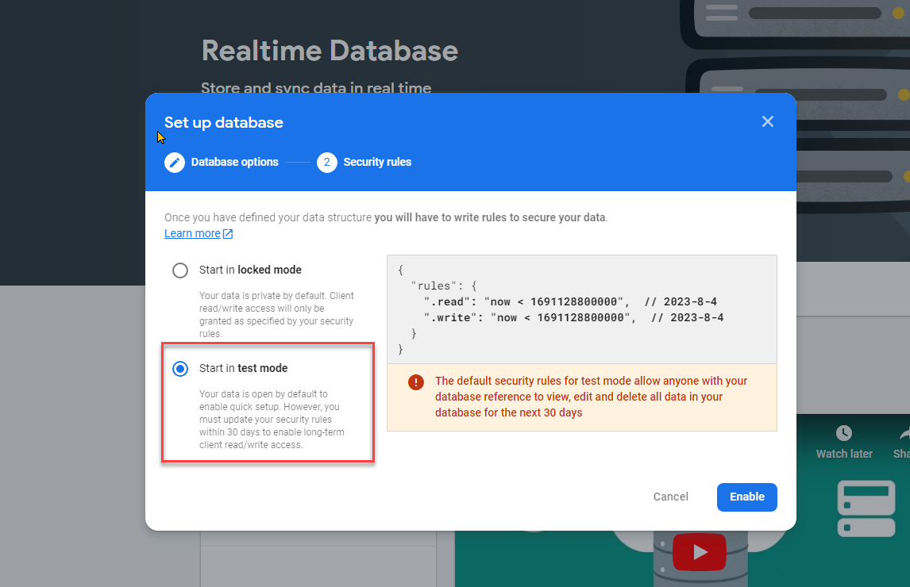
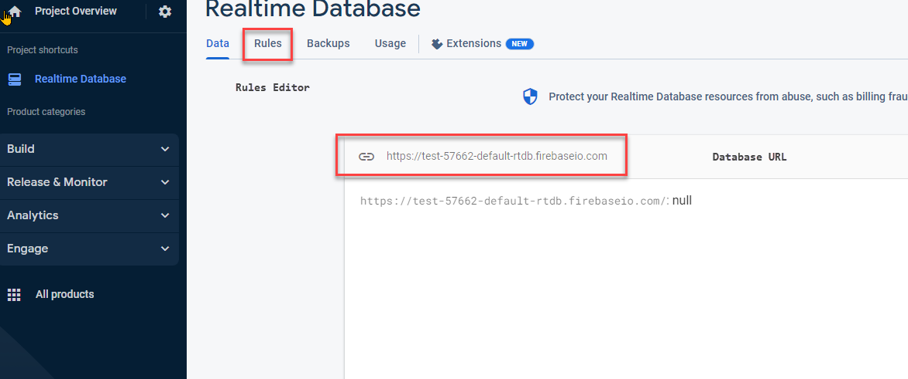
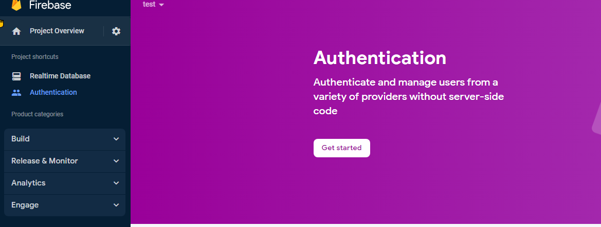
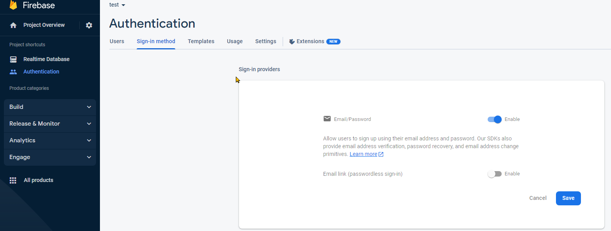
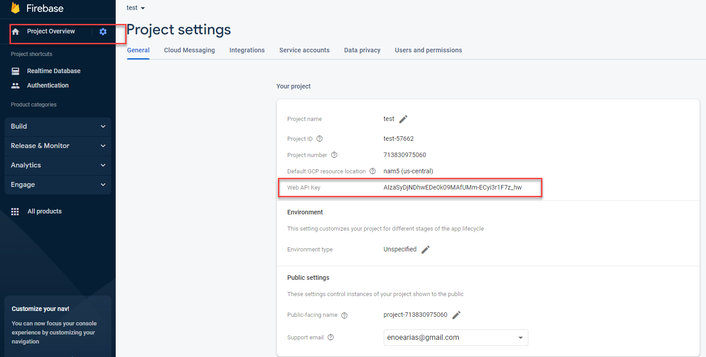
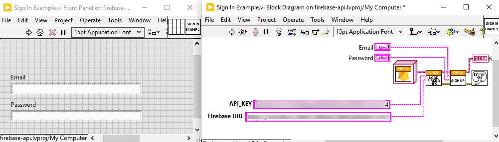
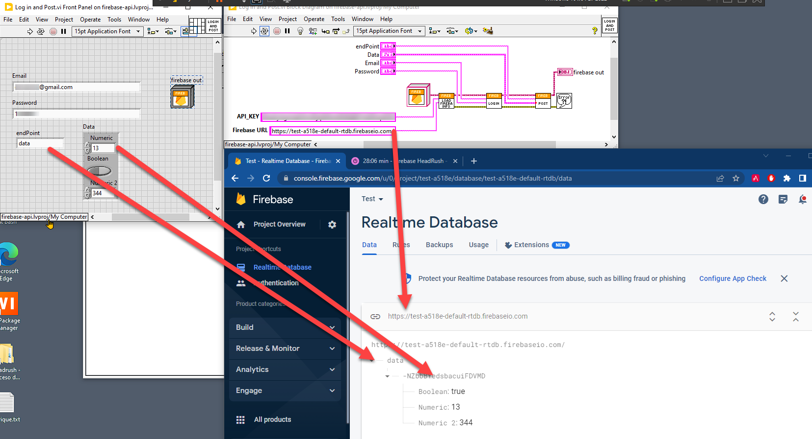

# firebase-api

## How to create  a firebase project:

1. go to https://firebase.google.com/
2. Click  the button  "Get Started"
3. Click  the button "Add Project"
4. Add a project  Name
5. Disable "Enable Google Analytics for this project" and click "Create project"
6. Create new Real Time Database  
7. Click  The Button  "Create Database"
8. Select the desired Location and click "Next"
9. Select Test Mode and click Enable  
10. Locate the DB URL and the rules editor This is the "Firebase URL" to be used by the API  

## How to enable Authentication:

1. Select Authentication and click "Get Started"  
2. Select Sign-in method tab and click the "Email/Password" Button  
3. Click the Enable "Email/Password" Checkbox and click the "Save" Button
4. Go to the Project Overview (click the gear button) and select "Project Settings", find the Web "API_Key"  

## Using Firebase API

### Autenticate a new User

Open Sign In Example.vi and update the "API_KEY" and "Firebase URL" with the ones obtained in the previous steps  

This Example will add your USER to the autenticated Users list  

### Post to Real Time DB

Open Log in and Post.vi Example, use your "API_KEY", "Firebase URL" and your Authenticated user to POST something to your Real Time Database, in this example we published a cluster called data, data is the endPoint name  

