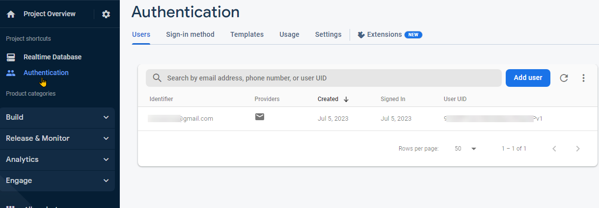

<a href="https://www.vipm.io/package/pantherlab_lib_firebase_api/"> </a> <a href="https://www.vipm.io/package/pantherlab_lib_firebase_api/"></a>

# firebase-api

## How to create  a firebase project:

1. go to https://firebase.google.com/
2. Click  the button  "Get Started"
3. Click  the button "Add Project"
4. Add a project  Name
5. Disable "Enable Google Analytics for this project" checkbox and click "Create project"
6. Create a new Real Time Database <br>
7. Click  The Button  "Create Database"


8. Select the desired Location and click "Next"
9. Select "Start in Test Mode" and click Enable <br>
10. Locate the DB URL and the rules editor This is the "Firebase URL" to be used by the API <br>

## How to enable Authentication:

1. Select Authentication and click "Get Started"
   

2. Select Sign-in method tab and click the "Email/Password" Button and then click "Save" Button <br>
3. Go to the Project Overview (click the gear button) and select "Project Settings", find the Web "API_Key" <br>


## Using Firebase API

### Autenticate a new User

Open Sign In Example.vi and update the "API_KEY" and "Firebase URL" with the ones obtained in the previous steps <br>

This Example will add your USER to the autenticated Users list <br>

### Post to Real Time DB

Open Log in and Post.vi Example, use your "API_KEY", "Firebase URL" and your Authenticated user to POST something to your Real Time Database, in this example we published a cluster called data, data is the endPoint name <br>

### Editing your Rules

Until this point your Real Time Database is open to any autenticated user, we can create rules to match our neads, for example, if this database is meant to be used by a company we can create rules to allow reading and/or writting for an specific domain<br>

Rules Example 1, allow writting and reading from specific domain  users:<br>
```
{
  "rules": {
    ".read": "auth.token.email.endsWith('@domain.com')",  
    ".write": "auth.token.email.endsWith('@domain.com')",  
  }
}
```
Rules Example 2, allow writting and reading from specific domain and filtering enabled to search under data/date
```
{
  "rules": {
    "data" : {
                ".indexOn": ["date"]
            },
     ".read": "auth.token.email.endsWith('@domain.com')",  
     ".write": "auth.token.email.endsWith('@domain.com')",  
    
  }
}
```
After you instal the VIPM Package there is an example provided for you, just drag it into your Block diagram and test it after setup your Firebase Database.

https://github.com/PantherLAB/Firebase/assets/5545396/ce6f4c28-2b27-4b92-8f17-094af907139e


For more rules examples go to:<br>
https://medium.com/@juliomacr/10-firebase-realtime-database-rule-templates-d4894a118a98<br>
https://firebase.google.com/docs/rules<br>


